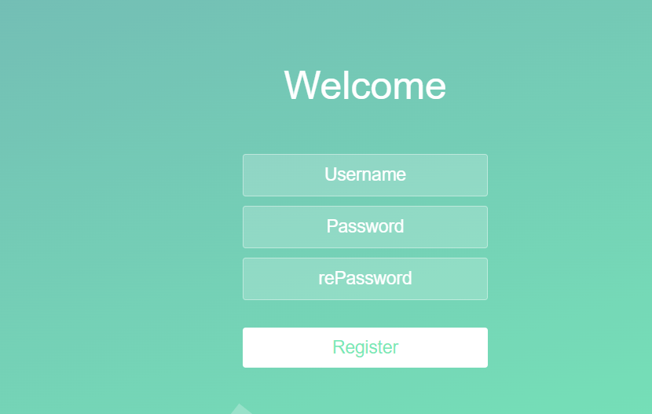
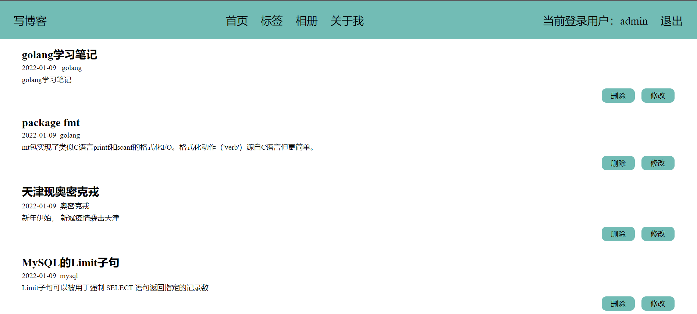
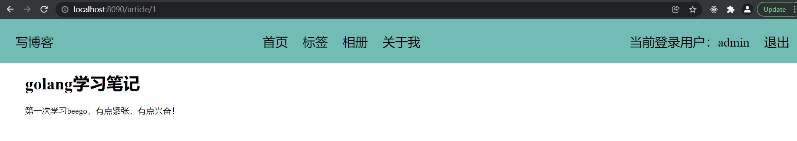
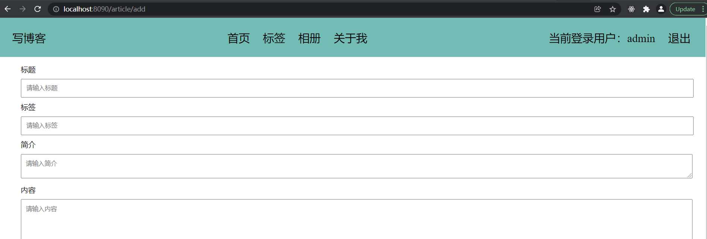
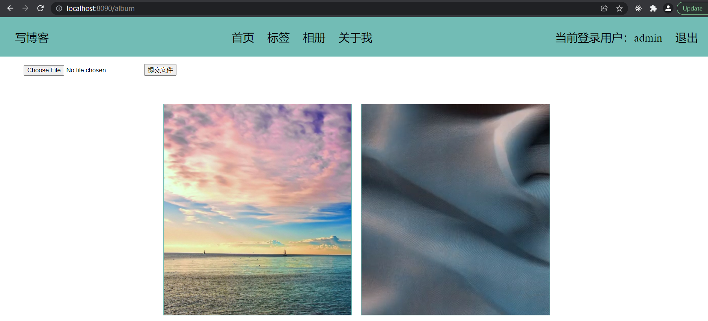
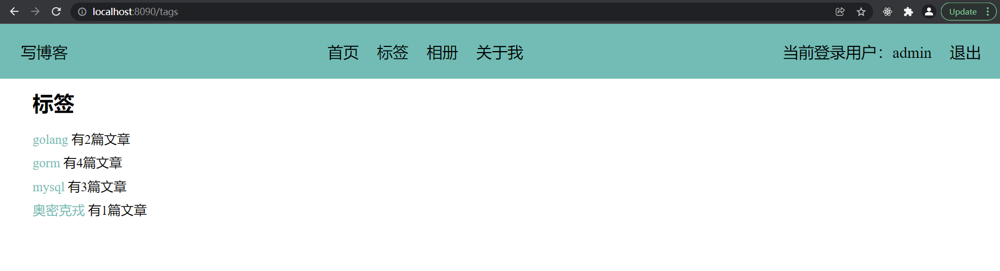
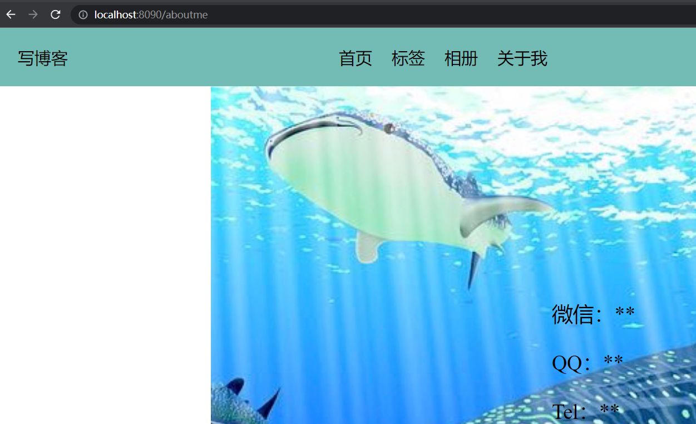

## BlogProject

技术栈：go1.17.6，Beego 1.12.2

### 运行效果：

注册：



登录：



查看详情：



写博客：



相册：



标签：



关于我：




### API：

项目用到的路由：

```go
    beego.Router("/", &controllers.HomeController{})
	beego.Router("/register", &controllers.RegisterController{})
	beego.Router("/login", &controllers.LoginController{})
    beego.Router("/exit/:name",&controllers.ExitController{})
    beego.Router("/article/add",&controllers.ArticleController{})
	beego.Router("/article/update",&controllers.ArticleController{})
	beego.Router("/article/:id",&controllers.ArticleController{},"GET:ShowArticleDetail")
	beego.Router("/article/delete",&controllers.ArticleController{},"GET:DeleteArticleById")
	//标签
	beego.Router("/tags", &controllers.TagsController{})

	//相册
	beego.Router("/album", &controllers.AlbumController{})
    //上传
	beego.Router("/upload", &controllers.AlbumController{})
	beego.Router("/aboutme", &controllers.AboutMeController{})
```


